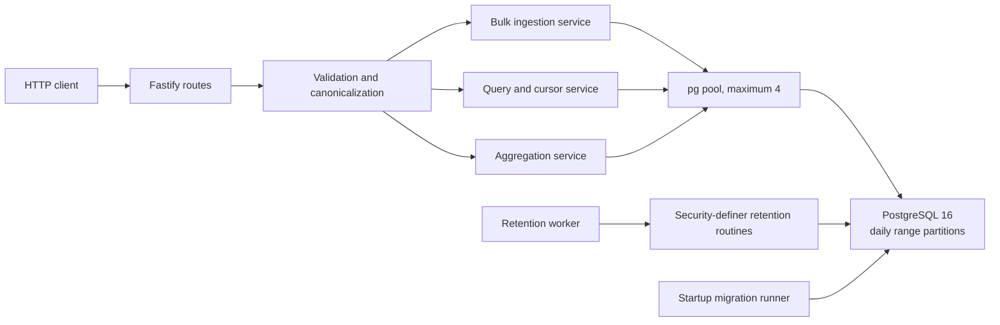

# LogStream

LogStream is a TypeScript/Fastify service that accepts structured logs, stores them in a partitioned PostgreSQL table, and exposes filtered query and time-bucket aggregation APIs. The required service starts with one command, applies database migrations automatically, and keeps the required application and database resource limits in Docker Compose.

## Quick start

Prerequisite: Docker with the Compose plugin.

```bash
docker compose up --build
```

No environment variables or auxiliary services are required. Wait for both services to become healthy, then use `http://localhost:8080`. The Compose file publishes the application only on `127.0.0.1` and persists PostgreSQL data in the `postgres-data` volume.

```bash
curl --fail http://localhost:8080/health
```

Expected healthy response:

```json
{ "status": "ok" }
```

Stop the stack without deleting its data:

```bash
docker compose down
```

For a clean local reset, explicitly remove the named Compose volume with `docker compose down --volumes`. That operation deletes the local database.

## Architecture



The code is organized around routes, services, repositories, domain validation, and database infrastructure. Route handlers translate HTTP input and output; services enforce application behavior; repositories own parameterized SQL. Startup uses an owner connection for checksum-verified migrations, then runtime traffic uses a role limited to `SELECT`, `INSERT`, and narrowly granted retention functions.

### Request and data flow

- Ingestion validates every element independently, generates UUID v4 identifiers for accepted rows, builds a normalized attribute-search document, and inserts the accepted portion of the batch in one transaction with typed arrays and PostgreSQL `UNNEST`. The HTTP response is sent only after commit.
- Query builds one parameterized predicate, orders by `timestamp DESC, id DESC`, requests `limit + 1` rows, and returns an opaque cursor when another page exists.
- Aggregation uses the same filters, PostgreSQL `date_bin` with a fixed Unix-epoch origin, and an allowlisted bucket and grouping expression. Results are ordered by bucket and group.
- Retention runs independently on an interval. An advisory lock prevents duplicate coordinators; expired whole partitions are dropped one at a time and expired default-partition rows are deleted in bounded, skip-locked batches.

Major design decisions and their alternatives are recorded in [`docs/adr`](docs/adr/README.md).

## HTTP API

All required endpoints use JSON. There is intentionally no authentication layer in the core specification, so deploy behind an authenticated gateway when logs are not meant to be public.

### `GET /health`

Returns `200` with `{"status":"ok"}` only when startup is ready and PostgreSQL is reachable. Otherwise it returns `503` with `{"status":"unavailable"}`.

### `POST /logs`

Request:

```bash
curl --request POST http://localhost:8080/logs \
  --header 'content-type: application/json' \
  --data '{
    "logs": [
      {
        "timestamp": "2026-08-13T12:00:00.000Z",
        "level": "info",
        "service": "checkout",
        "message": "payment accepted",
        "attributes": {"region": "il-central", "attempt": 1, "cached": false}
      },
      {
        "timestamp": "not-a-timestamp",
        "level": "info",
        "service": "checkout",
        "message": "this item is rejected"
      }
    ]
  }'
```

Use a current RFC 3339 timestamp when running the example: timestamps more than five minutes in the future are rejected, while old valid timestamps are accepted but may immediately qualify for retention.

Response when at least one item is accepted (`200`):

```json
{
  "accepted": 1,
  "rejected": [
    {
      "index": 1,
      "reason": "timestamp must be a timezone-bearing ISO 8601 date-time"
    }
  ]
}
```

The request body must be an object containing a `logs` array. Each item has this contract:

| Field        | Required | Rules                                                                                               |
| ------------ | -------- | --------------------------------------------------------------------------------------------------- |
| `timestamp`  | yes      | Timezone-bearing ISO/RFC 3339 timestamp; normalized to UTC; no more than five minutes in the future |
| `level`      | yes      | `debug`, `info`, `warn`, or `error`                                                                 |
| `service`    | yes      | Non-empty string without NUL                                                                        |
| `message`    | yes      | Non-empty string without NUL                                                                        |
| `attributes` | no       | Flat object; each value is a string, finite number, or boolean; defaults to `{}`                    |

Invalid entries are reported by their zero-based array index. A mixed batch commits all valid entries and returns `200`; an all-invalid or empty batch returns `400` with the same accepted/rejected envelope. A malformed top-level body returns `400` with `{"error":"Invalid ingestion request."}`.

### `GET /logs`

```bash
curl --get http://localhost:8080/logs \
  --data-urlencode 'service=checkout' \
  --data-urlencode 'level=info' \
  --data-urlencode 'since=2026-08-13T11:00:00Z' \
  --data-urlencode 'until=2026-08-13T13:00:00Z' \
  --data-urlencode 'attr.region=il-central' \
  --data-urlencode 'q=payment' \
  --data-urlencode 'limit=100'
```

Response:

```json
{
  "logs": [
    {
      "id": "6c06d330-9712-4a53-91ad-adc1cba0efb0",
      "timestamp": "2026-08-13T12:00:00.000000Z",
      "level": "info",
      "service": "checkout",
      "message": "payment accepted",
      "attributes": { "region": "il-central", "attempt": 1, "cached": false }
    }
  ],
  "next_cursor": null
}
```

| Parameter    | Meaning                                                                               |
| ------------ | ------------------------------------------------------------------------------------- |
| `service`    | Exact service match                                                                   |
| `level`      | Exact level match from the four accepted levels                                       |
| `since`      | Inclusive timestamp lower bound                                                       |
| `until`      | Exclusive timestamp upper bound; must not be earlier than `since`                     |
| `attr.<key>` | Exact normalized string equality for one or more flat attributes                      |
| `q`          | Case-insensitive literal substring search in `message`; `%` and `_` are not wildcards |
| `limit`      | Base-10 integer from 1 to 1000; default 100                                           |
| `cursor`     | Opaque cursor returned by the preceding request                                       |

Scalar parameters and each individual attribute key may appear at most once. Results are deterministic in descending `(timestamp, id)` order.

To fetch the next page, repeat exactly the same filters and add the returned cursor:

```bash
curl --get http://localhost:8080/logs \
  --data-urlencode 'service=checkout' \
  --data-urlencode 'limit=100' \
  --data-urlencode 'cursor=<next_cursor>'
```

The versioned base64url cursor contains the last `(timestamp, id)` position and a SHA-256 fingerprint of the filters. Canonical decoding and the fingerprint prevent accidental reuse with different filters. It is not signed and is not an authorization or integrity boundary. Pagination uses keyset comparison rather than offsets and does not provide a cross-request database snapshot; concurrent inserts can therefore change later pages.

### `GET /logs/aggregate`

```bash
curl --get http://localhost:8080/logs/aggregate \
  --data-urlencode 'since=2026-08-13T11:00:00Z' \
  --data-urlencode 'until=2026-08-13T13:00:00Z' \
  --data-urlencode 'bucket=5m' \
  --data-urlencode 'group_by=service' \
  --data-urlencode 'level=info'
```

Response:

```json
{
  "buckets": [{ "start": "2026-08-13T12:00:00.000000Z", "group": "checkout", "count": 1 }]
}
```

`since`, `until`, and `bucket` are required. `bucket` is one of `1m`, `5m`, `1h`, or `1d`; optional `group_by` is `service` or `level`. All query filters except `limit` and `cursor` are also available. When grouping is omitted, `group` is `null`. Buckets are fixed UTC intervals aligned to the Unix epoch; only non-empty buckets are returned.

## Storage, indexes, and retention

`logstream.logs` is a PostgreSQL range-partitioned parent table:

| Column                | Type and purpose                                         |
| --------------------- | -------------------------------------------------------- |
| `timestamp`           | `timestamptz`; event time and partition key              |
| `id`                  | `uuid`; generated tie-breaker                            |
| `level`               | checked text level                                       |
| `service` / `message` | non-empty text                                           |
| `attributes`          | original typed JSONB returned by the API                 |
| `attributes_search`   | normalized string-valued JSONB used by attribute filters |
| `created_at`          | server insertion time                                    |

The primary key is `(timestamp, id)`. The only additional index family is `(service, timestamp DESC, id DESC)`. Both propagate to leaf partitions. This small inventory keeps ingestion write amplification controlled while supporting global chronological pages and service-scoped pages. No GIN or message-search index is retained: attribute containment and literal substring filters may scan the pruned partitions, which is an explicit tradeoff until measurements justify another write-costly index.

Daily UTC partitions are created for the retention window plus two future days. The default partition safely accepts old or otherwise uncovered event times; partition maintenance atomically moves overlapping default rows before attaching a new day. Default retention is 30 days, checked every 60 minutes. Fully expired daily partitions are dropped, while expired rows in the default partition are deleted in bounded batches. Retention is based on event timestamp, so accepted late data can be removed on the next cycle.

## Errors and security posture

- Invalid bodies, filters, cursors, buckets, or groups return `400` with a stable JSON error.
- Allowlisted transient database-unavailability failures return `503`, a generic message, and `Retry-After: 30`.
- Unexpected failures return `500` without SQL, credentials, request bodies, or submitted log values.
- SQL values are parameters. The few dynamic SQL fragments—bucket intervals, grouping columns, and migration identifiers—come from structural allowlists or trusted migration code.
- Request IDs support correlation, while logging redacts database URLs and sensitive payload data.
- The runtime database role cannot migrate or drop arbitrary objects. Retention privileges are restricted through hardened `SECURITY DEFINER` functions.

The core API has no authentication, authorization, TLS termination, request rate limiting, or public maximum batch-size setting. Bindings are loopback-only in the local Compose setup, but an Internet-facing deployment needs a reverse proxy or gateway for those controls. Fastify must parse each submitted JSON body in memory, so operators should impose a gateway body-size/batch limit appropriate to their clients.

## Configuration and resource limits

| Variable                     |                  Default | Notes                                                           |
| ---------------------------- | -----------------------: | --------------------------------------------------------------- |
| `HOST`                       |                `0.0.0.0` | Listen address inside the container                             |
| `PORT`                       |                   `8080` | HTTP port                                                       |
| `LOG_LEVEL`                  |                   `info` | `fatal`, `error`, `warn`, `info`, `debug`, `trace`, or `silent` |
| `DATABASE_URL`               | Compose runtime-role URL | Runtime pool connection                                         |
| `MIGRATION_DATABASE_URL`     |   Compose owner-role URL | Startup migrations only                                         |
| `DB_POOL_MAX`                |                      `4` | Valid range 1–32                                                |
| `DB_CONNECTION_TIMEOUT_MS`   |                   `2000` | Valid range 1–60,000                                            |
| `DB_STARTUP_TIMEOUT_MS`      |                  `30000` | Valid range 1–300,000                                           |
| `DB_RETRY_DELAY_MS`          |                    `500` | Valid range 1–30,000 and no greater than startup timeout        |
| `RETENTION_DAYS`             |                     `30` | Valid range 1–3,650                                             |
| `RETENTION_INTERVAL_MINUTES` |                     `60` | Valid range 1–1,440                                             |

Compose enforces the company limits exactly: application `0.5 CPU / 256 MiB`, PostgreSQL `1 CPU / 1 GiB`. Local credentials in `docker-compose.yml` are development defaults, not production secrets. Replace them and use a proper secret provider outside the zero-configuration local stack.

## Development and validation

The repository pins Node.js `24.18.0`, npm `12.0.2`, application dependencies, and the PostgreSQL `16.14-bookworm` image.

```bash
npm ci
npm run format:check
npm run lint
npm run typecheck
npm run test:unit
npm run build
npm run test:integration
npm run test:contract
```

Unit tests cover domain and infrastructure behavior. PostgreSQL integration tests run migrations and exercise real queries, partitions, retention, and failures. Compose contract tests start the required stack and verify startup, HTTP behavior, limits, persistence, interruption diagnostics, and cleanup.

GitHub Actions repeats the quality job and Docker-backed system job on pushes, pull requests, and manual dispatches. The workflow uses read-only repository contents permission, pinned Node/npm versions, concurrency cancellation, diagnostic capture on failure, and guarded cleanup. The completed Stage 10.1 validation run is [GitHub Actions run 31702873356](https://github.com/AbdalrhemDado/log-stream/actions/runs/31702873356).

## Performance result

Under the exact Compose limits, the retained implementation sustained **16,031.716** and **17,059.228 confirmed accepted logs/second** in two independent one-million-row runs. The lower result exceeded the 15,000 logs/second target. The confirmation run measured ingestion request p50/p95/p99 of **66.934 / 103.867 / 187.095 ms**, concurrent aggregation p50/p95/p99 of **91.669 / 194.790 / 197.878 ms**, all 59 scheduled one-per-second aggregation calls successful with no missed ticks, public-API freshness of **96.912 ms**, and exact `1,010,000 / 1,010,000` row reconciliation.

These are controlled results from one host and deterministic workload, not a universal capacity promise. See the [final performance report](docs/performance/final-report.md) for methodology, environment, resource samples, rejected experiments, reproducibility commands, and machine-readable evidence.

## Optional-feature inventory and known limits

The required plain `docker compose up` path is the complete default product. No metrics endpoint, diagnostics endpoint, dashboard, external log shipper, Redis/cache, queue, authentication provider, or second startup profile is installed or required. Optional additions were deliberately not allowed to obscure the core API or resource accounting.

Important operating limits are:

- no authentication, authorization, TLS, or rate limiting in the service;
- no explicit public batch-count ceiling or streaming request parser;
- substring and arbitrary attribute queries can require partition scans;
- event-time retention can quickly remove very late accepted logs;
- cursors are filter-bound navigation tokens, not signed security tokens or snapshots;
- retention and query performance depend on event-time distribution and selectivity;
- absolute benchmark rates vary by host, Docker runtime, storage, and workload shape.

The detailed tradeoffs, alternatives, and evidence gates are in the [architecture decision records](docs/adr/README.md).
