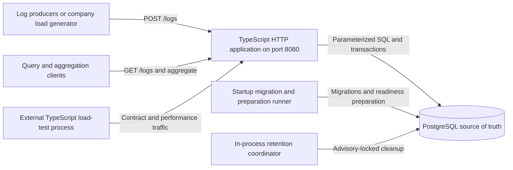
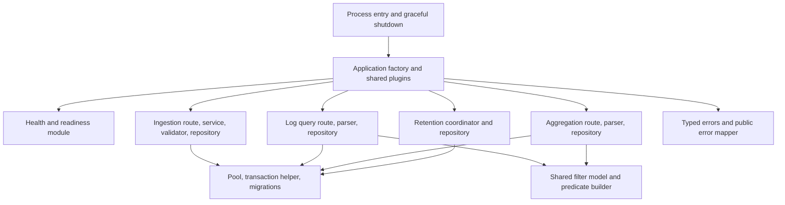
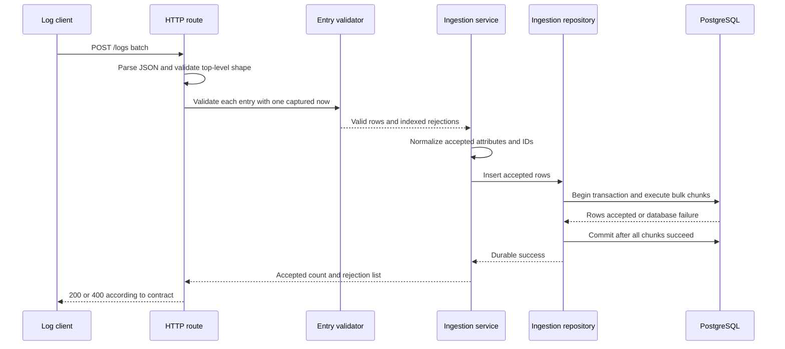
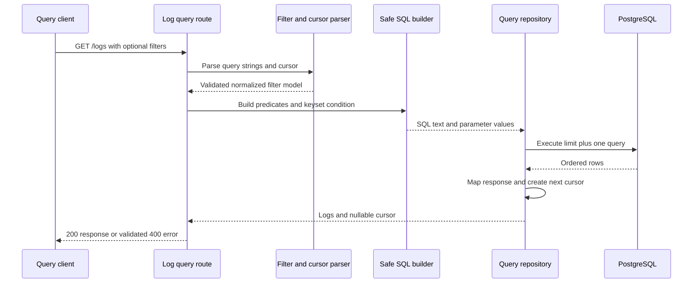
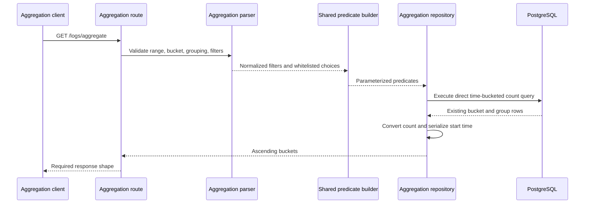
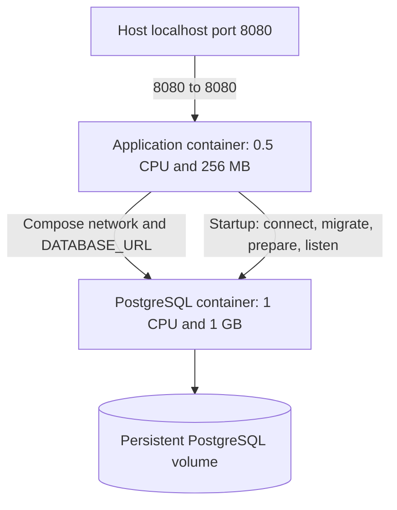
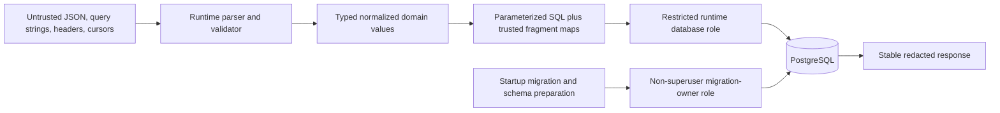
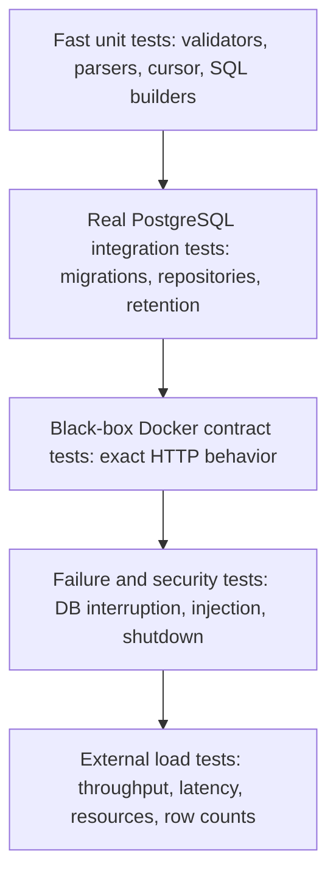

# Stage 0, Task 0.2 — Architecture and System-Design Proposal

## Document status

- **Status:** `PROPOSED — NOT APPROVED`
- **Scope:** architecture analysis and ADR plan only
- **Source of truth:** `docs/company-requirements.md`
- **Requirements baseline:** `docs/requirements-traceability.md`
- **Edge-case baseline:** `docs/edge-case-matrix.md`
- **Performance evidence:** pending; this document contains targets and hypotheses, not benchmark results

Every recommendation in this document is a proposal for review. No recommendation authorizes implementation until it is explicitly approved.

## Decision principles

1. Preserve the exact required API and zero-configuration Docker contract.
2. Keep PostgreSQL as the durable source of truth for reads and writes.
3. Prefer the smallest architecture that can plausibly meet the measured targets.
4. Optimize bulk work and query plans before adding services or infrastructure.
5. Parameterize user values and whitelist the few dynamic SQL fragments.
6. Treat indexes, partitions, pool sizes, and batch sizes as hypotheses to measure.
7. Keep optional features additive and behind the measured core.

## 1. High-level system architecture

### HTTP framework alternatives

| Alternative | Advantages | Disadvantages | Performance implications | Complexity implications | Interview implications |
|---|---|---|---|---|---|
| Fastify | Efficient request lifecycle, strong TypeScript ecosystem, schemas, hooks, and built-in structured logging | Plugin/decorator lifecycle must be learned; whole-body schemas could accidentally reject a mixed batch | Low framework overhead, but JSON parsing and schema choices still require measurement | Moderate framework surface with good lifecycle primitives | Supports a clear explanation of hooks, validation boundaries, and injection testing |
| Express | Familiar ecosystem and minimal concepts | More manual typing, error plumbing, logging, readiness, and shutdown work | Plausible, but commonly needs more middleware/allocation and still requires measurement | Low entry cost, more project-owned infrastructure | Familiar choice, though more time is spent rebuilding production boundaries |
| Raw Node HTTP | Full control and smallest dependency surface | Must implement routing, parsing, body limits, errors, logging, and lifecycle behavior | Can be lean but custom code is not automatically faster or safer | Highest project-owned correctness burden | Demonstrates fundamentals but distracts from the database/system-design goals |

### System-topology alternatives

| Alternative | Advantages | Disadvantages | Performance implications | Complexity implications | Interview implications |
|---|---|---|---|---|---|
| Modular monolith with synchronous PostgreSQL writes | One deployable app, immediate visibility, simple durability story, easy local Compose | App and database scale together; database is the main bottleneck | Avoids network hops and queue latency; bulk SQL can use the full DB budget | Lowest operational surface; clear route/service/repository boundaries | Easy to trace HTTP → validation → transaction → response |
| HTTP API plus queue and ingestion workers | Smooths bursts and isolates ingestion CPU | A success response cannot precede durable PostgreSQL acceptance without a more complex acknowledgement protocol; extra infrastructure | Queue can improve burst handling but adds serialization, copying, and eventual visibility | Requires queue durability, retries, poison-message handling, and more containers | Demonstrates distributed systems, but complicates proof of the required durability contract |
| Multiple microservices for ingestion, query, and retention | Independent deployment and ownership boundaries | Unnecessary network calls and operational overhead for a one-to-two-week project | More CPU/memory overhead under strict limits; does not improve a single PostgreSQL bottleneck | Highest complexity and failure surface | Harder to explain and debug live; likely viewed as over-engineering |

**PROPOSED — not approved:** use one Fastify-based modular TypeScript application plus PostgreSQL, with synchronous durable ingestion and an in-process retention coordinator. Do not add a queue, cache, or service split to the required path. PostgreSQL remains the source of truth.

**References:** `CORE-001`, `CORE-002`, `ING-013`, `INF-001`–`INF-003`, `PERF-001`–`PERF-006`, `EDGE-BAT-007`, `EDGE-BAT-008`.

**Training links:** Learn HTTP Servers in TypeScript explains the request lifecycle; Learn SQL explains transactions and durability; Learn Docker explains the two-container runtime; Build a Blog Aggregator in TypeScript connects repositories and scheduled work.

## 2. Component and module architecture

### Module-structure alternatives

| Alternative | Advantages | Disadvantages | Performance implications | Complexity implications | Interview implications |
|---|---|---|---|---|---|
| Feature modules with route/service/repository inside each feature | Related behavior stays together; shared SQL/filter code is explicit | Some repeated module structure | Calls remain direct functions; no meaningful runtime cost | Scales cleanly without abstract base classes | Lets the student trace one feature vertically |
| Global horizontal layers such as all routes, all services, all repositories | Familiar and initially simple | A feature change touches many distant directories | Similar runtime cost | Becomes harder to navigate as routes grow | Easy to describe layers but harder to demonstrate ownership |
| Hexagonal architecture with many ports/adapters | Strong substitution boundaries | Too many interfaces for a small service | Indirection is minor but mock-heavy designs can hide SQL behavior | Highest abstraction burden | Useful vocabulary, but can look ceremonial without multiple adapters |

**PROPOSED — not approved:** use Fastify and organize by feature with a small route → service → repository flow. Share only cross-cutting infrastructure: configuration, database pool/transactions, errors, logging, and the validated filter/predicate model. Repositories must not depend on HTTP request/reply objects. Entry-level batch validation stays in application logic so one invalid log cannot cause a framework schema to reject valid siblings.

**References:** `CORE-001`, `SEC-001`, `SEC-003`, `CI-001`; `EDGE-QRY-019`, `EDGE-BAT-009`.

**Training links:** Learn TypeScript covers dependency boundaries, interfaces, readonly domain values, and discriminated results. Build a Pokedex in TypeScript demonstrates separating transport JSON from validated domain data. Learn HTTP Servers in TypeScript explains route and lifecycle boundaries.

## 3. Ingestion request and data flow

### Alternatives

| Alternative | Advantages | Disadvantages | Performance implications | Complexity implications | Interview implications |
|---|---|---|---|---|---|
| Validate then synchronously bulk insert and commit | Exact accepted count, immediate query visibility, simple failure behavior | Request latency includes commit latency | Batching amortizes round trips; commit/WAL becomes visible bottleneck | Moderate and testable | Clear explanation of why `200` means durable acceptance |
| Accept into an in-memory queue and write later | Very low apparent response latency | Loses accepted data on crash and violates success semantics | Inflates throughput numbers without durable work | Requires retry/state machinery to become correct | Weak answer because success would not mean committed data |
| One database statement per log | Easiest SQL | Excessive round trips and transaction overhead | Unlikely to reach 15,000 logs/sec | Simple code, poor system design | Important anti-pattern to explain |

**PROPOSED — not approved:** validate the whole request in memory once, retain original rejection indexes, transform only valid entries, and perform set-based insertion. If an accepted set is internally chunked, execute all chunks in one transaction and respond only after commit. Database failure produces no accepted success.

**References:** `ING-001`–`ING-015`, `ING-013`, `REL-001`, `PERF-001`, `PERF-005`; `EDGE-ING-004`–`EDGE-ING-008`, `EDGE-BAT-001`–`EDGE-BAT-011`.

**Training links:** Build a Pokedex in TypeScript maps untrusted JSON into validated types; Learn TypeScript covers discriminated validation results and async errors; Learn SQL covers transactions and bulk insertion; Learn HTTP Servers in TypeScript covers malformed JSON and status mapping.

## 4. Query request and data flow

### Alternatives

| Alternative | Advantages | Disadvantages | Performance implications | Complexity implications | Interview implications |
|---|---|---|---|---|---|
| Shared typed filter model plus pure predicate builder | Query and aggregation semantics stay aligned; SQL values are testable | Requires careful parameter numbering and normalization | Enables plan-focused SQL and avoids ORM surprises | Moderate, with high testability | Strong explanation of validation versus parameterization |
| Build SQL directly inside handlers | Fewer files initially | Duplicated filters, security risk, difficult tests | Easy to generate unstable or non-indexable SQL | Low initial, high maintenance | Weak separation-of-concerns answer |
| Generic ORM filter API | Less handwritten SQL | JSONB, bucketing, keyset, and plan control may become opaque | Generated SQL can add overhead or defeat indexes | Library complexity replaces explicit query complexity | Harder to justify exact plans in an interview |

**PROPOSED — not approved:** parse all recognized values into a shared immutable filter model, decode/validate the cursor, construct parameterized predicates in a pure builder, fetch `limit + 1`, then build the next cursor from the last returned row. Unknown unrelated query parameters follow approved compatibility behavior and never enter SQL.

**References:** `QRY-001`–`QRY-018`, `SEC-001`, `SEC-002`; `EDGE-QRY-001`–`EDGE-QRY-020`, `EDGE-CUR-001`–`EDGE-CUR-008`.

**Training links:** Learn HTTP Clients in TypeScript explains query encoding and opaque cursor reuse; Learn HTTP Servers in TypeScript covers query parsing and `400`; Learn TypeScript covers safe narrowing into a filter type; Learn SQL covers predicates, ordering, and keyset conditions.

## 5. Aggregation request and data flow

### Alternatives

| Alternative | Advantages | Disadvantages | Performance implications | Complexity implications | Interview implications |
|---|---|---|---|---|---|
| Direct SQL aggregation over logs | Always current, simple consistency, arbitrary supported filter combinations | Reads base rows and indexes for each request | Plausible at one million rows with pruning/indexes, but must be measured under writes | Lowest operational complexity | Demonstrates `GROUP BY`, time bucketing, and plans clearly |
| Pre-aggregated rollup tables | Very fast repeated dashboards | Hard to maintain arbitrary `q` and attribute filters; eventual consistency | Reduces query CPU but increases write work and storage | Requires refresh/upsert pipeline and correctness tests | Good advanced topic, but risky before core evidence |
| External analytics store | Specialized query performance | Violates simplicity and duplicates source-of-truth flows | Extra write path and resource cost | Highest operational complexity | Distracts from PostgreSQL performance engineering |

### Bucketing-expression alternatives

| Alternative | Advantages | Disadvantages | Performance implications | Complexity implications | Interview implications |
|---|---|---|---|---|---|
| PostgreSQL `date_bin` with a fixed origin | Explicit interval alignment, one expression for all four fixed-duration buckets | Requires PostgreSQL 14 or newer and an intentional origin | Native calculation is suitable for grouping; the real plan still requires measurement | Low once version, interval map, and UTC rules are fixed | Makes bucket origin and half-open boundaries easy to explain |
| `date_trunc` plus arithmetic for multi-minute buckets | Familiar for hour/day truncation | Five-minute alignment requires extra arithmetic, and timezone behavior is easier to make inconsistent | Also plausible, but generates more expression variants to inspect | Moderate because each bucket needs separate reasoning | Useful comparison showing why `date_trunc` alone does not express every required bucket |
| Application-side bucketing | Full language-level control | Transfers rows out of PostgreSQL and duplicates grouping work | Increases data transfer and application CPU under the 0.5 CPU limit | Highest request-path complexity | A poor fit when PostgreSQL can aggregate directly |

**PROPOSED — not approved:** start with direct PostgreSQL aggregation using strict bucket/group maps and the same filter builder as `GET /logs`. Use PostgreSQL `date_bin` with PostgreSQL 16 as the compatibility baseline and pin the exact supported 16.x container tag or digest during Stage 2. Use the fixed origin `TIMESTAMPTZ '1970-01-01 00:00:00+00'`. Map only `1m`, `5m`, `1h`, and `1d` to trusted interval expressions; no client interval text enters SQL.

Every bucket represents the half-open interval `[start, start + bucket)`: an event exactly at `start` belongs to that bucket, and an event exactly at the next boundary belongs to the next bucket. Set the database/session timezone to UTC and serialize bucket starts as UTC timestamps. Equal `since`/`until` returns an empty array, and absent buckets remain omitted. Convert bigint counts to JSON numbers only under the approved count-safety policy. Consider rollups only after measured evidence shows the required p95 cannot be met safely.

Validation must cover all four interval mappings, the fixed origin, events immediately before/on/after boundaries, equivalent timestamp offsets, UTC serialization, day boundaries, and daylight-saving transitions in non-UTC client offsets. Plans and latency remain later evidence, not claims here.

**References:** `AGG-001`–`AGG-008`, `PERF-002`, `PERF-003`, `PERF-006`, `SEC-002`; `EDGE-AGG-001`–`EDGE-AGG-009`.

**Training links:** Learn SQL covers grouping, counts, date/time functions, and execution plans; Learn TypeScript covers literal-union whitelist maps and numeric conversion; Learn HTTP Clients in TypeScript supports the one-request-per-second load probe.

## 6. PostgreSQL schema alternatives

### Logical data required in every viable design

| Field | Logical purpose |
|---|---|
| `timestamp` | Required event time and primary range/partition key |
| `id` | Public unique identifier and deterministic tie-breaker |
| `level` | Constrained log severity |
| `service` | Exact-match filter and grouping dimension |
| `message` | Returned text and substring search source |
| `attributes` | Original flat values with JSON types preserved |
| searchable attribute representation | String-comparison behavior for `attr.<key>` |
| `created_at` | Operational ingestion time, distinct from event time |

### Alternatives

| Alternative | Advantages | Disadvantages | Performance implications | Complexity implications | Interview implications |
|---|---|---|---|---|---|
| One unpartitioned `logs` table | Simplest constraints, global unique index, simplest migrations | Retention requires deletes and vacuum; all indexes grow together | One million rows is modest, but cleanup can compete with ingestion | Lowest schema/operations complexity | Defensible if measurements show partitioning unnecessary |
| Range-partitioned `logs` parent by event timestamp | Fast whole-partition retention, pruning for bounded ranges, smaller local indexes | More DDL, default-partition handling, unique constraints must include partition key | Can reduce scanned data and retention disruption; adds planning/routing overhead | Moderate operational complexity | Strong discussion of pruning, retention, and composite uniqueness |
| EAV-centered schema with a log row plus attribute rows | Arbitrary keys become relational rows | Row explosion, joins, multi-row durability, complex response reconstruction | High write amplification and join cost at ingest scale | Highest schema/query complexity | Useful alternative to explain, but poor fit for this workload |

**PROPOSED — not approved:** use a timestamp-range-partitioned logical log table with a safe default partition. Proposed columns are `timestamp TIMESTAMPTZ`, application-generated `id UUID`, constrained `level TEXT`, literal-non-empty `service TEXT`, literal-non-empty `message TEXT`, `attributes JSONB`, `attributes_search JSONB`, and `created_at TIMESTAMPTZ`. The exact DDL, constraints, partition bounds, and defaults require ADR approval and integration tests.

This proposal intentionally does not claim partitioning is faster. Its primary reason is bounded retention; query benefits require `EXPLAIN ANALYZE` evidence.

**References:** `CORE-002`, `ING-003`–`ING-008`, `QRY-005`, `QRY-010`–`QRY-012`, `RET-001`–`RET-003`, `PERF-004`; `EDGE-ATTR-010`, `EDGE-ATTR-012`, `EDGE-RET-006`.

**Training links:** Learn SQL covers types, checks, primary keys, JSONB, partitioning, and constraints. Learn TypeScript covers the difference between transport, validated, and persistence models. Learn Docker connects schema initialization to PostgreSQL startup.

## 7. Attribute-storage alternatives

| Alternative | Advantages | Disadvantages | Performance implications | Complexity implications | Interview implications |
|---|---|---|---|---|---|
| One original JSONB column and `->>` comparisons | No duplicate storage; response is direct | Generic arbitrary-key string equality is difficult to index efficiently | Lower write cost, potentially expensive attribute scans | Simple writes, harder tuning | Shows JSONB extraction trade-offs |
| Original JSONB plus normalized string JSONB | Preserves response types and supplies uniform containment search | Duplicates attribute data and normalization CPU | Higher write/storage cost; supports a generic GIN candidate | Moderate, explicit transformation | Directly explains how typed responses coexist with string comparison |
| EAV attribute table | Relational key/value indexes and statistics | Multiple rows per log, joins, cascades, and type reconstruction | Significant write amplification and more random I/O | High | Good normalized-design comparison, weak throughput fit |
| Generated columns for selected keys | Excellent performance for known hot keys | Cannot cover arbitrary future keys without schema changes | Fast targeted queries, no generic solution | Operational schema churn | Appropriate only after stable production query evidence |

**PROPOSED — not approved:** store original attributes in `attributes` and a second object in `attributes_search` where strings remain unchanged, booleans become lowercase `"true"`/`"false"`, and finite numbers use one documented canonical number spelling. Query with a parameterized JSONB containment value rather than interpolating keys or values. Normalize missing attributes to `{}` in both persistence and response mapping. The exact numeric canonicalization and behavior for a JSON number outside JavaScript's safe/finite range remain approval and compatibility-test questions; they must not be left to accidental parser behavior.

**PROPOSED attribute-key safety:** accept and preserve an empty ingestion key because the company contract restricts attribute values but establishes no key restriction. Accept non-empty Unicode keys exactly as supplied, without silent normalization, and safely accept JavaScript-sensitive keys such as `__proto__` and `constructor` by iterating own properties and using null-prototype/internal-safe representations. Ingestion-key validity and query-parameter grammar are separate concerns: under the current proposal, the recognized query name `attr.` still lacks the required `<key>` segment and returns `400`, so an empty stored key is not addressable through that syntax unless a later decision explicitly changes `EDGE-QRY-004`. This proposes a compatibility-safe resolution for `DEC-012` but remains unapproved.

**References:** `ING-006`–`ING-008`, `QRY-005`, `QRY-006`, `QRY-012`, `SEC-001`; `EDGE-ATTR-001`–`EDGE-ATTR-012`, especially `EDGE-ATTR-007`–`EDGE-ATTR-010`; `EDGE-QRY-004`; `DEC-012`.

**Training links:** Learn TypeScript covers safe records, own-property iteration, and avoiding prototype hazards; Build a Pokedex in TypeScript covers preserving API data while deriving domain data; Learn SQL covers JSONB containment and GIN trade-offs.

## 8. ID and deterministic-ordering alternatives

| Alternative | Advantages | Disadvantages | Performance implications | Complexity implications | Interview implications |
|---|---|---|---|---|---|
| Application-generated UUID v4 | Built into Node, available before insert, easy bulk arrays, opaque public value | Random keys and only probabilistic uniqueness | UUID indexes are larger than bigint; partition-local random tie-breaker writes must be measured | Low | Easy to explain collision risk, portability, and batching |
| Application-generated UUID v7 | Time-ordered locality and available before insert | Requires a trusted implementation/dependency and careful timestamp behavior | Better B-tree locality in some layouts | Moderate | Modern choice with a richer trade-off discussion |
| Database sequence/bigint | Compact, ordered, database-guaranteed sequence values | Harder to prepare IDs before bulk insert; sequential IDs expose volume; partitioned uniqueness needs care | Small, cache-friendly indexes and cheap comparison | Moderate with partitioning/return mapping | Strong relational choice but less opaque |

**PROPOSED — not approved:** use application-generated UUID v4 values and order by `(timestamp DESC, id DESC)`. On a timestamp-partitioned table, enforce partition-compatible uniqueness on `(timestamp, id)` and treat UUID collision prevention as an application-generation invariant backed by tests. UUID generation cost and index size must be measured before final acceptance.

The keyset continuation predicate must use the same tuple: rows after a cursor satisfy `(timestamp, id) < (cursor_timestamp, cursor_id)` under descending order.

**References:** `QRY-010`, `QRY-011`, `QRY-014`, `QRY-018`; `EDGE-CUR-002`, `EDGE-CUR-008`.

**Training links:** Learn SQL covers composite ordering, tuple comparison, index key order, and partitioned uniqueness. Learn TypeScript covers opaque ID types and serialization. Learn HTTP Clients in TypeScript shows why clients must not interpret IDs or cursors.

## 9. Cursor-pagination alternatives

| Alternative | Advantages | Disadvantages | Performance implications | Complexity implications | Interview implications |
|---|---|---|---|---|---|
| Versioned base64url JSON with timestamp, ID, and filter fingerprint | Stateless, debuggable, no database lookup | Encoding is not encryption or authentication; a structurally valid changed position can be accepted | Constant-time codec; keyset SQL stays efficient | Low to moderate | Clear distinction between opacity, validation, filter binding, and integrity |
| HMAC-signed stateless cursor | Detects tampering before parsing values | Requires stable secret configuration/rotation and adds a feature not required by the contract | Small CPU cost; no DB lookup | Moderate | Demonstrates integrity controls but raises secret-lifecycle questions |
| Server-side cursor token stored in PostgreSQL/cache | Can enforce snapshot-like state and revoke tokens | Stateful cleanup, extra reads/writes, expiry semantics | Adds a lookup per page and storage contention | Highest | Usually unjustified for ordinary keyset pagination |

**PROPOSED — not approved:** use a versioned base64url JSON cursor containing the last timestamp, UUID, and a SHA-256 fingerprint of a canonical normalized-filter object. The fingerprint includes normalized `service`, `level`, `since`, `until`, `q`, the sorted resolved `attr.<key>` filters, and a cursor-semantics/sort version. It excludes ignored unknown parameters, the cursor itself, and `limit`; excluding `limit` intentionally lets a client change page size without changing the result set or ordering.

Validate the encoding, exact object shape, version, timestamp, UUID, and equality between the embedded fingerprint and the server-computed fingerprint for the current request. The fingerprint prevents accidental reuse with different normalized filters. It does **not** authenticate the timestamp or UUID position fields, because an unsigned cursor has no secret-backed integrity. A client that makes a structurally valid position change may receive a different valid continuation page; the cursor is pagination state, not an authorization boundary. Malformed or incompatible values return `400`.

**PROPOSED concurrent behavior:** use read-committed keyset continuation rather than a snapshot. Newer rows inserted ahead of the cursor may not appear in later pages; rows deleted by retention may disappear. The service guarantees deterministic continuation among rows that still exist, not a frozen multi-request snapshot.

Cursor validation gates cover malformed base64url, malformed JSON, wrong version, wrong shape, invalid timestamp/UUID, normalized-filter mismatch, and the documented acceptance behavior for a structurally valid changed position. Tests must not claim that unsigned-cursor tampering is universally detectable.

**References:** `QRY-010`, `QRY-013`–`QRY-018`, `SEC-003`; `EDGE-CUR-001`–`EDGE-CUR-008`, `DEC-014`.

**Training links:** Learn HTTP Clients in TypeScript covers passing opaque cursors unchanged; Learn TypeScript covers codec validation and discriminated failures; Learn SQL covers keyset pagination and read-committed behavior.

## 10. Index-strategy alternatives

| Alternative | Advantages | Disadvantages | Performance implications | Complexity implications | Interview implications |
|---|---|---|---|---|---|
| Create every plausible B-tree, GIN, and trigram index immediately | Broad query acceleration from day one | High write amplification, larger memory/storage footprint, longer migrations | May prevent the ingestion target despite fast reads | Easy DDL, difficult performance diagnosis | Weak evidence story because indexes were not justified individually |
| Minimal baseline plus evidence-gated indexes | Protects write path and isolates each index's value | Some filters may initially scan until experiments are completed | Enables clean before/after ingestion and query comparisons | Requires disciplined benchmark stages | Strong explanation of query-pattern-driven indexing |
| One very wide composite index | Can cover one chosen filter order | Freely combinable filters do not share one leading-column order | Often unused when leading columns are absent | Appears simple but is brittle | Good example of why composite order matters |

**PROPOSED — not approved baseline:**

1. Partition-compatible primary/unique B-tree on `(timestamp, id)`, scanned backward for `(timestamp DESC, id DESC)` range order and cursor pagination; do not create a duplicate index when the constraint already supplies it.
2. B-tree on `(service, timestamp DESC, id DESC)` for exact service plus recent/range queries.
3. B-tree on `(level, timestamp DESC, id DESC)` as a benchmark candidate because level has low cardinality and may not justify its write cost.
4. GIN `jsonb_path_ops` on `attributes_search` only after measuring containment queries and ingestion cost.
5. Trigram index on a case-folded message expression only after measuring literal substring queries and ingestion cost.

The first two are the proposed initial schema baseline. Items 3–5 are explicit experiments, not pre-approved indexes. PostgreSQL may combine indexes with bitmap scans, but every retained index needs `EXPLAIN ANALYZE` and throughput evidence.

**References:** `QRY-001`–`QRY-010`, `AGG-004`, `PERF-001`–`PERF-004`, `SEC-001`; `EDGE-QRY-005`, `EDGE-QRY-009`, `EDGE-QRY-019`, `EDGE-ATTR-012`.

**Training links:** Learn SQL covers B-tree, GIN, trigram, bitmap scans, selectivity, and composite-key order. Build a Blog Aggregator in TypeScript provides the write-pipeline context for index cost. Learn Docker relates observed CPU/I/O to container limits.

## 11. Partitioning alternatives

| Alternative | Advantages | Disadvantages | Performance implications | Complexity implications | Interview implications |
|---|---|---|---|---|---|
| No partitioning | Simplest keys, indexes, and queries | Retention deletes create dead tuples and vacuum work | Potentially excellent at one million rows until cleanup competes with writes | Low | Honest option because one million rows is not automatically large |
| Daily timestamp partitions | Roughly one partition per day, precise retention drops, strong time pruning | Startup/DDL/default-partition logic and partition-aware constraints | Smaller indexes and cheap expiry; more planning and insert routing | Moderate | Rich discussion of pruning and operational retention |
| Monthly timestamp partitions | Few partitions and simple management | Retention granularity is coarse; partial-month cleanup still deletes | Low planning overhead but weaker retention isolation | Moderate-low | Shows that partition granularity follows retention behavior |

**PROPOSED — not approved:** use daily range partitions on event timestamp, pre-create the configured retention window plus at least two future days, and keep a default partition for otherwise valid out-of-window timestamps. Readiness waits for required current/future partitions, but routine retention must not block readiness indefinitely. Partition preparation must explicitly detect rows in the default partition whose range is about to become a named partition and safely move or retain them before attachment; PostgreSQL must never discover this overlap accidentally during startup DDL.

At roughly one month of data this produces a manageable number of partitions. The proposal must be reversed if migration/startup, planning, or insertion measurements show it harms the required workload more than bounded deletion would.

**References:** `RET-001`–`RET-003`, `HLT-001`, `HLT-002`, `PERF-002`–`PERF-004`; `EDGE-RET-003`, `EDGE-RET-004`, `EDGE-RET-006`, `EDGE-ATTR-012`.

**Training links:** Learn SQL covers range partitioning, pruning, partitioned constraints, and planner behavior. Learn Docker covers idempotent startup preparation. Build a Blog Aggregator in TypeScript connects recurring partition preparation to scheduled jobs.

## 12. Retention architecture alternatives

| Alternative | Advantages | Disadvantages | Performance implications | Complexity implications | Interview implications |
|---|---|---|---|---|---|
| In-process worker with PostgreSQL advisory lock | No extra service, shared configuration, multiple-instance safety | Worker lifecycle shares the app process; failures need observability | Partition drops are cheap; default cleanup can be bounded | Moderate | Demonstrates timers, locks, cancellation, and failure isolation |
| PostgreSQL scheduler extension | Cleanup stays near data | Extension/preload availability and Docker configuration become requirements | Avoids app timers but uses database CPU | Moderate operational coupling | Requires explaining extension deployment and database job visibility |
| Separate cron/worker container | Independent resources and lifecycle | Extra service, coordination, and zero-config startup surface | Can isolate CPU, but total allowed resources are unclear | Highest for this project | More operationally realistic, but likely unnecessary |

**PROPOSED — not approved:** use an in-process coordinator that obtains a PostgreSQL advisory lock, creates future partitions, drops fully expired daily partitions individually, and deletes expired default-partition rows in bounded committed batches. It records duration, removed partitions/rows, and failures. Shutdown cancels future work but does not corrupt an active database transaction.

**PROPOSED retention semantics:** accept otherwise valid old logs because the ingestion contract has no lower timestamp bound; they are immediately eligible for retention. Define expired as `timestamp < cutoff`; a timestamp exactly equal to the cutoff remains until a later run.

**References:** `RET-001`–`RET-003`, `REL-001`, `PERF-003`; `EDGE-VAL-012`, `EDGE-RET-001`–`EDGE-RET-006`, `DEC-015`.

**Training links:** Build a Blog Aggregator in TypeScript covers periodic background work; Learn TypeScript covers timers, abort signals, and error isolation; Learn SQL covers advisory locks, bounded deletes, WAL, vacuum, and partition drops; Learn Docker covers graceful process lifecycle.

## 13. Bulk-ingestion alternatives

| Alternative | Advantages | Disadvantages | Performance implications | Complexity implications | Interview implications |
|---|---|---|---|---|---|
| Parameterized multi-row `VALUES` | Familiar SQL and easy for small batches | Generates large SQL text and many placeholders | Better than per-row inserts, but parsing/parameter count grows | Low to moderate | Good baseline, weaker at large variable batches |
| Typed arrays with `UNNEST` | Stable SQL text, set-based insertion, straightforward transaction use | Requires parallel arrays, casts, and careful equal lengths | Few round trips and good batching; conversion/copy cost must be measured | Moderate | Strong demonstration of PostgreSQL arrays and set-based work |
| PostgreSQL `COPY` stream | Usually highest raw ingest throughput | More complex JSON encoding, stream errors, transactions, and library support | Best candidate if `UNNEST` is proven insufficient | High | Excellent performance topic, but must justify added failure complexity |
| One insert per row | Very simple | Round-trip and statement overhead per log | Not credible for the target | Low code complexity, high operational cost | Important rejected alternative |

**PROPOSED — not approved:** begin with one typed-array `UNNEST` statement per measured internal chunk. If a request requires multiple chunks, wrap all accepted chunks in one transaction so the response represents one durable outcome. A starting experiment may compare chunks of 500, 1,000, and 5,000 rows; these are internal experiments, not public batch limits.

Run a controlled `UNNEST` versus `COPY` experiment only if the durable `UNNEST` path misses the target or consumes excessive CPU/memory. Do not choose `COPY` based on reputation alone.

**References:** `ING-009`, `ING-013`, `PERF-001`, `PERF-005`, `REL-001`; `EDGE-BAT-007`–`EDGE-BAT-011`.

**Training links:** Learn SQL covers arrays, casts, `UNNEST`, `COPY`, transactions, and commits. Learn TypeScript covers memory-efficient transformations and async failure propagation. Learn HTTP Clients in TypeScript explains how client batch size and concurrency shape server throughput.

## 14. SQL and data-access strategy

| Alternative | Advantages | Disadvantages | Performance implications | Complexity implications | Interview implications |
|---|---|---|---|---|---|
| `pg` with explicit parameterized SQL and small pure builders | Full SQL/plan control, transparent bulk operations, minimal abstraction | More handwritten mapping and tests | Lowest abstraction overhead; easiest plan tuning | Moderate but localized in repositories | Best visibility for `EXPLAIN ANALYZE` and injection prevention |
| Typed query builder such as Kysely | Compile-time assistance and composable queries | Dynamic JSONB/bucketing SQL still needs escape hatches | Usually small overhead but generated SQL must be inspected | Adds library concepts | Good production option, less direct SQL teaching |
| Full ORM | Fast CRUD modeling and migrations | Poor fit for bulk arrays, partitions, arbitrary JSON filters, and plan work | Risk of inefficient SQL and object allocation | High framework surface | Harder to explain exact database behavior |

**PROPOSED — not approved:** use `pg`, plain parameterized SQL, feature repositories, and a small pure predicate builder returning SQL text plus readonly values. Interpolate only fragments selected from hard-coded maps for bucket, grouping, and known columns. User-supplied attribute keys/values travel inside JSONB parameters, never as identifiers. Ordinary repositories use the restricted runtime database role proposed in Section 19, not the schema owner or PostgreSQL superuser.

**References:** `CORE-002`, `SEC-001`, `SEC-002`, `QRY-001`–`QRY-008`, `AGG-002`–`AGG-004`; `EDGE-QRY-004`, `EDGE-QRY-009`, `EDGE-QRY-019`, `EDGE-ATTR-007`–`EDGE-ATTR-009`.

**Training links:** Learn SQL covers parameterization, predicates, JSONB, and query plans; Learn TypeScript covers pure builders and repository return types; Learn HTTP Servers in TypeScript reinforces keeping transport objects out of persistence code.

## 15. Migration strategy

| Alternative | Advantages | Disadvantages | Performance implications | Complexity implications | Interview implications |
|---|---|---|---|---|---|
| Small ordered SQL migration runner in the app | Exact SQL, automatic zero-config startup, teachable advisory-lock flow | Must implement checksums/history/error handling carefully | Startup-only cost; no runtime ORM layer | Moderate | Strong explanation of idempotency, locks, and forward fixes |
| Lightweight migration library | Mature bookkeeping and CLI support | Dependency conventions may complicate container startup | Similar startup cost | Moderate library learning | Demonstrates pragmatic reuse |
| Docker init scripts only | Simple first database initialization | Do not handle upgrades of an existing volume reliably | Fast first start, incomplete lifecycle | Low initially, unsafe later | Weak production migration story |

**PROPOSED — not approved:** implement a small ordered SQL-file runner backed by a migration table, checksum, and PostgreSQL advisory lock. Apply one migration transaction at a time where the DDL permits it. The runner opens a short-lived connection as the non-superuser migration-owner role, performs migrations and required startup partition preparation, then closes that connection before ordinary traffic starts. The request pool connects separately as the restricted runtime role. A migration or privilege/readiness check failure keeps health non-ready. Use forward-fix migrations rather than automatic destructive rollback.

**References:** `INF-001`, `HLT-001`, `HLT-002`, `DEL-002`, `SEC-001`; `EDGE-RET-004`, `EDGE-BAT-009`.

**Training links:** Learn SQL covers DDL transactions, locks, migration tables, and forward fixes. Learn TypeScript covers startup orchestration and typed failures. Learn Docker covers persistent volumes and why initialization scripts are not full migrations.

## 16. Database connection-pool strategy

| Alternative | Advantages | Disadvantages | Performance implications | Complexity implications | Interview implications |
|---|---|---|---|---|---|
| One small application pool | Simple lifecycle and shared visibility | Long aggregation can queue ingestion if pool is undersized | Low connection overhead; batching reduces required connections | Low | Explains why more connections do not create more CPU |
| Separate ingestion and query pools | Can reserve capacity by workload | Doubles tuning knobs and can exceed useful DB concurrency | May protect ingestion, but can oversubscribe a one-CPU database | Moderate | Useful isolation discussion, probably premature |
| PgBouncer sidecar | Efficient connection multiplexing | Extra container/configuration and transaction-mode caveats | Helpful at many clients, unnecessary for one app with a small pool | High for this scope | Production concept without evidence of need |

**PROPOSED — not approved:** use one `pg` pool with a baseline maximum of four connections, then compare 2, 4, and 8 under the required workload. Migrations run before traffic using a dedicated acquired client; retention uses the same pool and a non-blocking advisory-lock attempt. Export pool wait/active/idle observations without high-cardinality labels.

The one-CPU PostgreSQL limit means excess connections can increase context switching and latency. The target is sufficient concurrency for one aggregation request plus batched writes, not maximum connection count.

**References:** `INF-003`, `PERF-001`–`PERF-006`, `REL-001`; `EDGE-BAT-010`, `EDGE-RET-003`, `EDGE-RET-004`.

**Training links:** Learn SQL covers sessions, transactions, and locks; Learn TypeScript covers pool acquisition/release in `try/finally`; Learn Docker connects pool sizing to database CPU/memory limits.

## 17. Docker and runtime architecture

### Alternatives

| Alternative | Advantages | Disadvantages | Performance implications | Complexity implications | Interview implications |
|---|---|---|---|---|---|
| App and PostgreSQL containers; app runs startup preparation | Exactly two services, simple zero-config startup | App startup owns migrations and readiness sequencing | Minimal runtime overhead | Low to moderate | Clear distinction between Compose order and actual readiness |
| Separate migration container plus app and PostgreSQL | Isolates migration lifecycle | Compose completion/race behavior and another service to explain | Startup-only overhead | Moderate | Common production pattern, less necessary here |
| Add queue/cache/connection-proxy containers | Specialized capabilities | More resources, health dependencies, and failure modes | Can exceed constraints without solving one-CPU DB limit | High | Over-engineering without evidence |

**PROPOSED — not approved:** use a pinned Node.js LTS multi-stage image, non-root runtime user, production-only dependencies, one application process, and one PostgreSQL 16 service with a persistent volume; Stage 2 pins exact supported image tags or digests. Compose maps `8080:8080`, supplies safe built-in local-development/grading credentials for bootstrap, migration-owner, and runtime roles so no environment file is required, configures health checks, and expresses target resource limits where supported. These public built-in defaults are not production secrets and must be overrideable without changing the zero-configuration graded path. The application never uses the PostgreSQL superuser for requests. It retries database connection, runs migrations/preparation with the owner credential, closes that connection, verifies the runtime role and required permissions, then listens/reports ready. Graceful SIGTERM stops new traffic, drains in-flight requests within a deadline, cancels future retention work, and closes the runtime pool.

**References:** `INF-001`–`INF-003`, `HLT-001`, `HLT-002`, `DEL-002`, `OPT-002`; `EDGE-OPT-001`, `EDGE-BAT-011`, `EDGE-RET-005`.

**Training links:** Learn Docker covers build stages, non-root users, networks, volumes, health checks, limits, and signals. Learn HTTP Servers in TypeScript covers listen/readiness/shutdown. Learn SQL covers connection retry and migration readiness.

## 18. Error-handling architecture

| Alternative | Advantages | Disadvantages | Performance implications | Complexity implications | Interview implications |
|---|---|---|---|---|---|
| Typed application errors plus one public mapper | Consistent status/body, redaction, centralized logging policy | Requires disciplined error translation at boundaries | Negligible overhead | Moderate and testable | Strong explanation of expected versus unexpected failure |
| Route-local `try/catch` responses | Quick for a few routes | Duplicated behavior, leaks, inconsistent status codes | Negligible runtime difference | Low initially, high maintenance | Weak reliability story |
| Return result objects for every operation | Explicit failures without exceptions | Verbose across async database boundaries | Small allocation cost | High ceremony | Useful concept, but can obscure ordinary exceptional failures |

**PROPOSED — not approved:** define typed client/validation errors, readiness/unavailable errors, and internal/database errors. A central mapper returns required `400` shapes for invalid queries, route-specific ingestion `400` behavior, `503` with a stable public error and `Retry-After` for temporary database unavailability, and `500` for unexpected bugs. Log internal cause and request ID, never stack traces, SQL text with secrets, credentials, or raw database messages to clients.

For `POST /logs`, a database failure returns no accepted-success body. This is the proposed resolution of `DEC-016`; exact wording remains approval-dependent.

**References:** `ING-012`, `ING-013`, `QRY-015`, `AGG-008`, `SEC-003`, `REL-002`; `EDGE-BAT-005`–`EDGE-BAT-009`, `EDGE-CUR-001`.

**Training links:** Learn TypeScript covers error classes, `unknown` catches, and cause chains. Learn HTTP Servers in TypeScript covers status codes and centralized hooks. Learn HTTP Clients in TypeScript covers retryable versus non-retryable responses.

## 19. Security boundaries and SQL-injection prevention

### Alternatives

| Alternative | Advantages | Disadvantages | Performance implications | Complexity implications | Interview implications |
|---|---|---|---|---|---|
| Parameterize every value and whitelist identifier fragments | Correct separation of data from SQL syntax | Requires a deliberate builder and tests | Efficient plan reuse; small builder cost | Moderate | Required strong answer for SQL injection prevention |
| Escape/interpolate strings manually | Appears flexible | Error-prone and disqualifying if bypassed | No meaningful advantage | Hidden complexity and severe risk | Unacceptable answer |
| Trust an ORM to make all SQL safe | Common CRUD values are parameterized | Raw fragments, JSON paths, identifiers, and bucketing still need review | Generated SQL can be opaque | False sense of safety | Must still explain actual boundaries |

### PostgreSQL privilege alternatives

| Alternative | Advantages | Disadvantages | Performance implications | Complexity implications | Interview implications |
|---|---|---|---|---|---|
| One non-superuser schema-owner login for migrations and traffic | Simple credentials and all DDL/DML works without grants | A request-path SQL defect or compromise has schema-changing privileges | No meaningful steady-state speed benefit | Lowest setup complexity, largest database blast radius | Easy to build but difficult to defend as least privilege |
| Separate migration-owner and restricted runtime roles | Ordinary traffic cannot perform arbitrary schema changes; permissions are reviewable | Requires role/grant migrations, two credentials, and a narrow retention-privilege design | Privilege checks are negligible; narrow retention functions add only task-level overhead | Moderate startup and migration complexity | Demonstrates practical least privilege and ownership semantics |
| PostgreSQL superuser for the application | Avoids permission failures | Gives request traffic cluster-wide administrative power | No justified performance benefit | Simple initially, unacceptable security exposure | Not defensible for this service |

**PROPOSED — not approved privilege model:** PostgreSQL bootstrap initialization creates a non-superuser migration-owner login and a separate non-superuser runtime login. The owner owns the application schema, migration history, tables, partitions, and narrowly scoped retention routines. Startup migrations and required partition preparation use a short-lived owner connection. The ordinary application pool uses only the runtime role with `CONNECT`, schema `USAGE`, required `SELECT`/`INSERT`, and only the mutation permissions needed by approved ingestion/retention behavior.

Because partition creation/drop normally requires ownership, ongoing retention should invoke tightly scoped owner-defined `SECURITY DEFINER` routines rather than grant the runtime role arbitrary DDL or owner membership. Such routines must pin a safe `search_path`, schema-qualify objects, validate inputs internally, revoke default `PUBLIC` execution, and grant `EXECUTE` only to the runtime role. Default-partition cleanup may use narrowly granted `DELETE` or the same routines. The custom migration runner creates and grants these objects; readiness verifies both schema state and a runtime-role connection/permission smoke check.

Compose supplies distinct safe built-in credentials so plain `docker compose up` remains sufficient. Credentials are never logged or returned, and owner connections are closed before listening. The application process may still receive the startup owner credential, so role separation reduces database blast radius but does not provide complete security against full process compromise. Production secret injection and stronger process separation remain deployment concerns beyond the graded default.

**PROPOSED — not approved controls:**

- Parse network inputs from `unknown`; TypeScript types never replace runtime checks.
- Parameterize service, level, times, attribute search objects, message search values, limits, and cursor-derived values.
- Escape `%`, `_`, and the escape character for literal `q` semantics before passing the pattern as a parameter.
- Select bucket, grouping column, and sort fragments only from exhaustive constant maps.
- Build attribute containment JSON with safe own-property handling; never interpolate an attribute key into SQL.
- Accept empty ingestion attribute keys without using them as SQL structure; continue treating bare `attr.` as a malformed recognized query name under `EDGE-QRY-004`.
- Ignore approved unknown fields without persisting or reflecting them.
- Run the container as non-root; never use the PostgreSQL superuser or migration owner for ordinary request traffic.
- Keep authentication and tenancy out of the core until optional requirements are explicitly selected.

**References:** `INF-001`, `HLT-002`, `CORE-002`, `SEC-001`–`SEC-003`, `OPT-001`–`OPT-006`, `QRY-005`, `QRY-008`, `AGG-002`, `AGG-003`; `EDGE-QRY-004`, `EDGE-QRY-009`, `EDGE-QRY-019`, `EDGE-ATTR-007`, `EDGE-ATTR-008`, `DEC-012`.

**Training links:** Learn SQL covers parameterization versus escaping and identifier whitelists. Learn TypeScript covers `unknown`, type guards, safe object ownership, and exhaustive maps. Build a Pokedex in TypeScript reinforces that external JSON is hostile until validated. Learn Docker covers OS/database least privilege.

## 20. Testing architecture

### Alternatives

| Alternative | Advantages | Disadvantages | Performance implications | Complexity implications | Interview implications |
|---|---|---|---|---|---|
| Vitest unit tests plus real PostgreSQL integration and Docker contract tests | Tests actual SQL/types/migrations and public behavior | Slower suite and database lifecycle management | Gives trustworthy query/ingest evidence | Moderate | Clear unit/integration/contract distinction |
| Mock database for most tests | Very fast and isolated | Mocks cannot validate SQL, JSONB, transactions, partitions, or plans | No reliable performance signal | Low runtime setup, high false confidence | Weak for a PostgreSQL-heavy project |
| Only end-to-end tests | Realistic public behavior | Slow diagnosis and poor edge coverage | Expensive to run; hard to benchmark components | Low test architecture, high debugging cost | Cannot explain isolated validation/query-builder guarantees |

**PROPOSED — not approved:** use Vitest for unit and integration orchestration; pure table-driven unit tests for validators/parsers/codecs/builders; real PostgreSQL integration tests for migrations/repositories/retention; black-box tests against Compose for the exact contract; explicit failure/security tests; and a separate TypeScript load generator for performance. Do not mock PostgreSQL behavior that the project is meant to demonstrate.

**References:** `CI-001`, `PERF-007`, `DEL-003`, all endpoint requirement groups; `EDGE-BAT-007`–`EDGE-BAT-011`, `EDGE-QRY-019`, `EDGE-CUR-001`–`EDGE-CUR-008`, `EDGE-RET-001`–`EDGE-RET-006`.

**Training links:** Learn TypeScript covers unit-testable pure functions. Learn HTTP Clients in TypeScript and Build a Pokedex in TypeScript cover typed black-box clients. Learn SQL covers integration assertions and plans. Learn Docker covers full-system testing.

## 21. Performance architecture

No number in this section is a measured result. Each item is a design hypothesis tied to a later benchmark.

| Required target | Proposed architectural response | Required validation |
|---|---|---|
| At least 15,000 logs/sec | Set-based `UNNEST`, internal chunk experiments, one transaction per accepted request, minimal initial indexes, low-volume structured logging | Sustained external load under exact limits; reconcile HTTP accepted total with PostgreSQL count |
| Approximately 1,000,000 rows/month | Daily partitions, compact fixed columns, JSONB attributes, bounded partition count | Load/seed realistic distributions; inspect table/index sizes and plans |
| Aggregation under one second p95 | Time pruning, direct SQL aggregation, shared selective predicates, evidence-gated indexes | One aggregation request/sec during ingestion; record p50/p95/p99 and plans |
| Concurrent ingestion and aggregation | Small shared pool, batched writes, no long retention transaction | Observe pool waiting, transaction latency, query latency, accepted rate, DB CPU/I/O |
| App at 0.5 CPU/256 MB | One Node process, no cluster, avoid repeated object copies, internal chunks, bounded log volume | `docker stats`, process RSS/heap, event-loop lag, CPU throttling observation |
| PostgreSQL at 1 CPU/1 GB | Small pool, controlled indexes, short transactions, no extra analytical store, no durability cheating | DB CPU/memory/I/O, WAL volume, checkpoints, query plans, lock waits |
| Visibility within 20 seconds | Synchronous commit and direct reads from PostgreSQL | Timed ingest-to-query probes; expected visibility should normally be immediate after success |

### Alternatives for performance posture

| Alternative | Advantages | Disadvantages | Performance implications | Complexity implications | Interview implications |
|---|---|---|---|---|---|
| Evidence-driven single-node PostgreSQL tuning | Directly matches grading environment and source-of-truth rule | Requires careful experiments and may reveal hard limits | Optimizes the actual bottleneck | Moderate | Strong scientific engineering narrative |
| Add caching/rollups/queues before baseline | May improve selected metrics | Can hide correctness, add stale data, and consume limits | Unclear net effect without baseline | High | Looks like premature optimization |
| Relax durability settings | Artificially high throughput | Violates data safety and project rules | Misleading numbers and data loss risk | Low configuration effort, unacceptable outcome | Disqualifying trade-off |

**PROPOSED — not approved:** establish a correctness-first baseline under exact limits, then tune one variable at a time: chunk size, pool size, index set, GIN/trigram settings, partitioning, logging, and only then `COPY`. Keep PostgreSQL durability enabled. Record unsuccessful experiments.

**References:** `INF-003`, `PERF-001`–`PERF-007`, `REL-001`, `ING-013`, `RET-002`; `EDGE-BAT-010`, `EDGE-QRY-020`, `EDGE-ATTR-011`, `EDGE-RET-003`.

**Training links:** Learn HTTP Clients in TypeScript covers concurrency and latency collection; Learn TypeScript covers allocation-aware transformations and statistics; Learn SQL covers execution plans, WAL, checkpoints, vacuum, and indexes; Learn Docker covers resource measurement and throttling.

## 22. Expected bottlenecks and measurement plan

| Hypothesized bottleneck | Why it may matter | How to measure | Candidate experiments |
|---|---|---|---|
| JSON parsing and per-entry validation | App has only 0.5 CPU and must examine every entry | Validator microbenchmark, request CPU, event-loop lag | Validation implementation, batch size, reduced transformations |
| Attribute normalization and serialization | Dual JSONB duplicates transformation and payload work | CPU profile, heap/RSS, bytes per row | Single versus dual representation evidence, chunk size |
| UUID generation | One ID per accepted log | Microbenchmark and CPU profile | UUID v4 versus approved alternative only if material |
| PostgreSQL client parameter encoding | Large parallel arrays and JSONB values are copied/encoded | Ingestion transaction timing and Node CPU | Chunk sizes, prepared statement behavior, `COPY` comparison |
| WAL flush and commit | Durable success waits for commit | Commit latency, WAL bytes, checkpoint logs/statistics | Batch size and transaction grouping; never disable durability |
| Index write amplification | Every index updates for every row | Throughput and WAL before/after each index | Remove/retain indexes based on combined read/write evidence |
| GIN pending-list behavior | Attribute index can defer and later batch maintenance | GIN stats where available, latency spikes, WAL | GIN presence/options and maintenance behavior |
| Trigram message index | Substring support can create a large expensive index | Index size, ingestion delta, `q` plans | No index versus trigram after representative messages |
| Partition planning/routing | Many child relations affect planning and inserts | Planning time, execution time, insert throughput | Daily versus unpartitioned controlled experiment if needed |
| Aggregation scans/sorts | One query/sec competes with writes on one CPU | p50/p95/p99, buffers, plan nodes, temp I/O | Indexes, bucket expression, predicate selectivity |
| Pool queueing | Too few connections queue; too many contend | Active/idle/waiting counts and request timing | Pool max 2, 4, 8 |
| Retention locks/WAL | Cleanup can interrupt ingestion | Lock waits, cleanup duration, ingestion/query latency during cleanup | Partition drop versus bounded default deletes |
| Load generator saturation | Client can become the bottleneck | Client CPU, achieved request rate, server idle/CPU comparison | Concurrency, batch size, separate host/process |

Measurement runs must record hypothesis, Git commit, configuration, database state, dataset distribution, batch size, concurrency, query rate, accepted/rejected counts, request errors, database row count, p50/p95/p99, resource usage, query plans, and bottlenecks. No benchmark claim is valid without row reconciliation.

**References:** `PERF-001`–`PERF-007`, `REL-001`, `DOC-001`, `DEL-003`.

**Training links:** Learn HTTP Clients in TypeScript covers coordinated load and error accounting; Learn SQL covers `EXPLAIN ANALYZE`, buffers, locks, WAL, and vacuum; Learn Docker covers container metrics; Learn TypeScript covers percentile calculation and deterministic load data.

## 23. Optional additions that do not risk the core

| Alternative | Advantages | Disadvantages | Performance implications | Complexity implications | Interview implications |
|---|---|---|---|---|---|
| Bounded-cardinality `/metrics` | Direct operational and performance visibility | Instrumentation and endpoint maintenance | Small counter/timer overhead that must be measured | Low to moderate | Strong production-readiness signal |
| Read-only `/admin/stats` diagnostics | Excellent demo of sizes, partitions, retention, version | Must avoid secrets/raw errors and expensive catalog queries | On-demand overhead; can be disabled by default | Moderate | Helpful live-debug and PostgreSQL explanation |
| Static dashboard | Visible polish | Frontend time can displace core tuning | Adds client traffic and build work | Moderate-high | Good demo, weaker backend depth per hour spent |
| Authentication/multi-tenancy | Security depth | Exact optional contract, migrations, CI matrix, and tenancy isolation | Adds request and database work | High | Valuable only after core is complete |
| Rollups/live tail/alerts | Distinctive capabilities | New consistency and delivery semantics | Extra write/query load | High | Interesting, but risky under schedule |

**PROPOSED — not approved:** after the core contract and load targets pass, choose at most two additions: bounded operational metrics first and a safe read-only diagnostics endpoint second. Measure metrics overhead; keep arbitrary values out of labels. Keep diagnostics disabled by default or inexpensive and additive. Do not select dashboard, auth, rollups, live tail, or alerts initially.

**References:** `OPT-001`–`OPT-007`, `DOC-001`, `REL-001`, `DEL-003`; `EDGE-OPT-001`–`EDGE-OPT-005`.

**Training links:** Learn HTTP Servers in TypeScript covers additive endpoints; Learn SQL covers safe catalog/statistics queries; Learn Docker covers process metrics; Learn HTTP Clients in TypeScript can consume diagnostics; optional auth connects HTTP credentials to database isolation only if later selected.

## Proposed architecture summary

**PROPOSED — not approved:**

- One Fastify-based modular TypeScript application and one PostgreSQL database.
- Feature modules with shared configuration, database, filters, errors, and logging.
- Synchronous per-entry validation followed by durable set-based PostgreSQL ingestion.
- Timestamp-daily partitioned logs with a default partition.
- Original plus normalized-string JSONB attributes.
- Application-generated UUID v4 IDs and `(timestamp DESC, id DESC)` ordering.
- Versioned base64url keyset cursor with normalized-filter fingerprint.
- UTC `date_bin` aggregation with a fixed epoch origin and half-open buckets.
- Minimal initial B-tree indexes; GIN, trigram, and level indexes require evidence.
- In-process advisory-locked retention using partition drops and bounded default cleanup.
- `UNNEST` first; `COPY` only after a controlled need is demonstrated.
- Plain parameterized SQL via `pg`, pure predicate builders, and feature repositories.
- Ordered SQL migrations with history/checksums and an advisory lock.
- Separate non-superuser migration-owner and restricted runtime database roles.
- One pool starting at four connections, then measured at 2/4/8.
- Two-container Compose runtime with readiness after DB/migrations/preparation.
- Typed errors, centralized redaction, `503` for temporary database unavailability.
- Unit, real-PostgreSQL integration, black-box contract, failure/security, and load-test layers.
- Optional metrics and diagnostics only after the measured core succeeds.

## Proposed ADR list

| ADR | Topic | Status |
|---|---|---|
| `0001` | HTTP framework and module boundaries | PROPOSED |
| `0002` | PostgreSQL access and safe query construction | PROPOSED |
| `0003` | Log schema and attribute storage | PROPOSED |
| `0004` | Identifiers, deterministic ordering, and cursor semantics | PROPOSED |
| `0005` | Evidence-gated indexing strategy | PROPOSED |
| `0006` | Partitioning and retention architecture | PROPOSED |
| `0007` | Bulk ingestion and connection pooling | PROPOSED |
| `0008` | Migrations and readiness | PROPOSED |
| `0009` | Docker runtime and shutdown | PROPOSED |
| `0010` | Error handling and security boundaries | PROPOSED |
| `0011` | Testing and performance validation | PROPOSED |
| `0012` | Optional additions posture | PROPOSED |

## Important trade-offs

1. Daily partitions improve retention isolation but complicate keys, startup, and planning.
2. Dual JSONB makes string equality indexable but increases every write and row size.
3. Minimal indexes protect ingestion but allow slower secondary filters until evidence supports more indexes.
4. `UNNEST` is simpler than `COPY`, but the final choice must follow durable throughput evidence.
5. A small shared pool respects one database CPU but can queue mixed workloads.
6. Stateless unsigned cursors are simple and adequate for pagination, but their fingerprint binds normalized filters only; it does not authenticate cursor-position fields.
7. Direct aggregation stays current and simple but may eventually require evidence-backed rollups.
8. Separate owner/runtime roles reduce ordinary SQL blast radius but add grant, retention-routine, and credential-lifecycle complexity.

## Risks

- The proposed partitioning/dual-JSONB/index combination may create enough write amplification to miss 15,000 logs/sec.
- The app's 0.5 CPU may be consumed by JSON parsing, normalization, UUID generation, or PostgreSQL parameter encoding before the database saturates.
- Direct aggregation may exceed p95 during ingestion without a carefully bounded primary query and index plan.
- A default partition can accumulate old data if retention fails.
- Recovery after missed partition creation can require moving overlapping default-partition rows before a new daily partition can be attached.
- Liberal arbitrary attribute keys require careful JavaScript object handling.
- Numeric attribute canonicalization must avoid accidental precision, overflow, or query-string mismatches.
- An unsigned cursor permits structurally valid position changes; this is acceptable only because cursors are not authorization boundaries.
- Incorrect `SECURITY DEFINER` ownership, `search_path`, or grants could undermine the proposed database-role separation.
- A four-connection pool is only a starting hypothesis.
- Framework body parsing holds the JSON batch in memory; very large valid batches require measured protections without breaking the load generator.
- The external load generator itself can cap observed throughput.

## Open questions requiring approval

1. Approve Fastify and the feature-module modular monolith?
2. Approve daily timestamp partitions, or prefer an unpartitioned first version with bounded deletion?
3. Approve dual original/search JSONB attributes?
4. Approve accepting and preserving empty ingestion attribute keys while keeping bare query parameter `attr.` invalid, and safely accept non-empty Unicode and JavaScript-sensitive keys?
5. Approve UUID v4 and the `(timestamp, id)` order?
6. Approve an unsigned versioned cursor whose fingerprint includes normalized filters/sort version, excludes `limit`, and does not authenticate position fields, with documented read-committed continuation semantics?
7. Approve the two-index initial baseline and evidence gates for level/GIN/trigram indexes?
8. Approve old-log acceptance followed by retention eligibility, with `< cutoff` expiry?
9. Approve `UNNEST` as the first bulk method and `COPY` as a later experiment?
10. Approve plain `pg` SQL and a small custom migration runner?
11. Approve pool max 4 as the initial measured setting?
12. Approve `503` plus `Retry-After` for temporary database failures?
13. Approve metrics and diagnostics as the only first optional candidates after core success?
14. Approve the attribute-number string canonicalization and finite/safe-range compatibility policy after focused parser examples.
15. Approve UTC `date_bin` with a fixed Unix-epoch origin and half-open bucket intervals on the pinned PostgreSQL 16 compatibility baseline?
16. Approve separate non-superuser migration-owner/runtime roles and narrowly scoped retention routines?
17. Resolve remaining Stage 0.1 decisions: ISO 8601 profile, duplicate query parameters, repeated attribute keys, empty `q`, minimum limit, and same-bucket group ordering.

## Interview questions and model answers

### Why not add a queue for ingestion?

A queue can absorb bursts, but the endpoint may return success only after PostgreSQL durably accepts the data. Waiting for a queued worker removes most latency benefit while adding failure and retry complexity. Direct set-based writes keep the guarantee clear.

### Why store attributes twice?

The API must return original string, number, and boolean types but compare attribute filters as strings. One JSONB object preserves original types; the normalized object provides uniform string-search semantics and a candidate generic GIN path. The cost is extra CPU, storage, and write amplification.

### Why can too many indexes reduce correctness under load?

Every accepted log must update every index before commit. Excess indexes increase CPU, WAL, I/O, and commit latency, which can reduce sustainable accepted throughput or cause overload. Each index needs read benefit and write-cost evidence.

### Why use keyset instead of offset pagination?

Keyset pagination seeks from the last `(timestamp, id)` tuple using an index. Offset must scan and discard earlier rows, gets slower on deep pages, and is more unstable as rows are inserted or deleted.

### What does a database transaction guarantee for a split batch?

All accepted chunks commit together or none of them do. Therefore the `accepted` count cannot claim rows that were only partially written before an error.

### Why not use many database connections?

PostgreSQL has one CPU in the target environment. More connections create more runnable work, not more CPU, and can increase context switching and tail latency. Bulk statements let a small pool do high row throughput.

### Why partition at only one million rows?

The proposal is driven mainly by retention isolation, not the belief that one million rows requires partitioning for queries. Dropping a fully expired partition avoids large deletes and bloat. The extra planning and operational cost still needs measurement.

### How is SQL injection prevented when query structure is dynamic?

All user values remain parameters. Only bucket, grouping, and known-column fragments selected from hard-coded exhaustive maps can enter SQL text. Attribute keys are encoded into a JSONB parameter, not interpolated as SQL identifiers.

### Why accept an empty ingestion attribute key while rejecting `attr.`?

The company limits attribute value types but does not limit keys, so rejecting an empty stored key would add an undocumented ingestion rule. Query grammar is separate: `attr.<key>` requires a key segment, so bare `attr.` can remain an invalid recognized parameter without making the stored object invalid.

### Why does a bucket need an origin and half-open boundaries?

The origin fixes where repeated intervals begin, so every client receives identical bucket alignment. Half-open `[start, end)` intervals assign a boundary event exactly once: the ending boundary is the next bucket's start.

### Does validating an unsigned cursor detect tampering?

It detects malformed structure, invalid fields, and a mismatch between the request filters and their fingerprint. It cannot authenticate a structurally valid changed timestamp or ID; HMAC signing would be required for cryptographic integrity.

### Why separate migration-owner and runtime database roles?

Migrations need ownership and DDL, but ordinary requests need only narrow data operations. Separating them limits the damage from a request-path SQL defect; it does not replace parameterization, safe retention routines, credential protection, or container security.

## What to study before implementation

1. **Learn TypeScript:** `unknown`, type guards, discriminated unions, readonly types, async errors, dependency boundaries, safe record/object handling.
2. **Learn HTTP Servers in TypeScript:** Fastify lifecycle, body/query parsing, error hooks, readiness, graceful shutdown, request IDs.
3. **Learn HTTP Clients in TypeScript:** query encoding, opaque cursors, concurrency, latency/error collection, retries.
4. **Build a Pokedex in TypeScript:** translate untrusted JSON into validated domain data without trusting compile-time interfaces.
5. **Learn SQL:** transactions, `UNNEST`, `COPY`, JSONB, B-tree/GIN/trigram, keyset pagination, `GROUP BY`, `date_bin`, UTC bucket origins, roles/grants, `SECURITY DEFINER`, partitions, locks, WAL, vacuum, and `EXPLAIN ANALYZE`.
6. **Build a Blog Aggregator in TypeScript:** repositories, idempotent startup work, scheduled retention, persistence failure handling.
7. **Learn Docker:** multi-stage builds, Compose networks/volumes, health checks, resource limits, signals, and reproducible full-system testing.

Before Stage 1, the student should be able to explain the proposed ingestion/query flows, the dual-JSONB trade-off, why indexes cost writes, how keyset pagination works, and why every performance statement still requires measurement.
