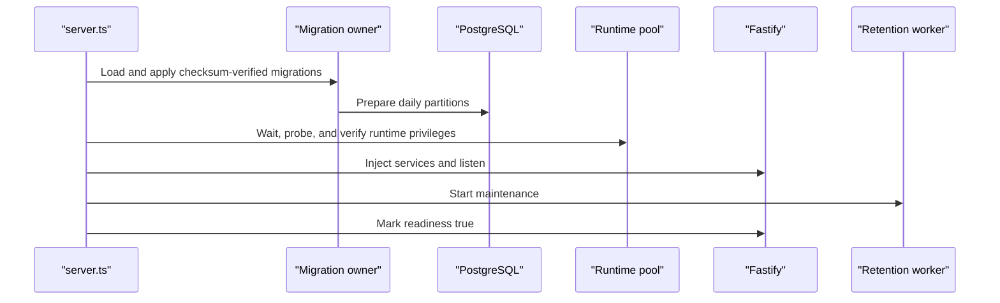

# LogStream Code Walkthrough

This guide follows the runtime path rather than directory order. Read it with the code open and explain each boundary in your own words.

## 1. Startup, migrations, and dependency wiring

Entry point: [`src/server.ts`](../src/server.ts).



`main()` loads application and database configuration, then `migrateBeforeRuntime()` serializes owner migration work before runtime startup. Migration history stores checksums, so edited applied SQL fails startup rather than silently changing history. [`partition-plan.ts`](../src/database/partitions/partition-plan.ts) builds deterministic UTC day names/ranges, and [`partition-preparer.ts`](../src/database/partitions/partition-preparer.ts) invokes the hardened owner routine.

`startRuntime()` creates a bounded `pg` pool and waits for PostgreSQL using a deadline and retry delay. It verifies runtime access, constructs repositories, injects them into services, and gives those services to [`buildApp()`](../src/app.ts). This is manual dependency injection: constructors accept narrow interfaces rather than importing global singletons, which makes clocks, timers, UUID generators, and database adapters replaceable in tests.

Readiness stays false until migrations, database verification, listen, and retention startup settle. An idle pool error marks the process unavailable. [`server-lifecycle.ts`](../src/server-lifecycle.ts) handles `SIGINT`/`SIGTERM` once, marks not-ready, closes Fastify, stops retention, closes PostgreSQL, and enforces a ten-second shutdown deadline.

Teaching points:

- TypeScript return types derive configuration shape without duplicating interfaces.
- `unknown` catch variables require narrowing before use.
- Startup order is a correctness property: runtime queries must never race unapplied schema.
- Owner/runtime role separation is least privilege, not merely connection organization.

## 2. HTTP application boundary

[`src/app.ts`](../src/app.ts) creates Fastify with generated UUID request IDs, exposes `x-request-id`, registers one error handler, and installs health/log routes. Client-provided request IDs are deliberately not trusted.

[`src/routes/logs.ts`](../src/routes/logs.ts) is intentionally thin:

- `POST /logs` calls ingestion and selects HTTP 200 versus 400 from accepted count;
- `GET /logs` delegates query parsing and pagination;
- `GET /logs/aggregate` delegates aggregation parsing and SQL.

No route builds SQL. This keeps HTTP semantics visible and database behavior testable without a socket.

## 3. Ingestion: HTTP body to COMMIT

```mermaid
sequenceDiagram
    participant C as "Client"
    participant F as "Fastify route"
    participant S as "Ingestion service"
    participant V as "Domain validator"
    participant R as "Ingestion repository"
    participant D as "PostgreSQL"
    C->>F: POST /logs {logs:[...]}
    F->>S: body as unknown
    loop each original array index
        S->>V: validate entry against one reference time
        V-->>S: accepted value or stable reason
    end
    S->>S: UUID + normalized search attributes
    S->>R: accepted records only
    R->>D: BEGIN
    R->>D: INSERT ... FROM UNNEST(typed arrays)
    R->>D: COMMIT
    D-->>R: committed
    R-->>S: success
    S-->>F: accepted count + rejected original indexes
    F-->>C: 200 if any accepted; otherwise 400
```

[`ingestion-service.ts`](../src/modules/ingestion/ingestion-service.ts) first validates the top-level `logs` array. It captures one clock value for the entire batch, which prevents the future-time cutoff from drifting between entries. Each item goes through [`log-entry-validator.ts`](../src/domain/log-entry-validator.ts). The validator checks required fields, enum membership, non-empty strings, timezone-bearing calendar-valid timestamps, the five-minute future bound, flat attribute scalar types, and U+0000 compatibility.

Successful parsing produces branded [`CanonicalUtcTimestamp`](../src/domain/log-entry.ts) values. Branded strings are still strings at runtime; the brand is a compile-time proof that the parser established the invariant. [`timestamp.ts`](../src/domain/timestamp.ts) retains a strict canonical-millisecond fast path but falls back to the general timezone/precision parser for all other supported forms.

[`attribute-normalizer.ts`](../src/domain/attribute-normalizer.ts) creates a null-prototype search object. Strings remain strings, finite numbers use JSON serialization (`-0` becomes `0`), and booleans become lowercase text. The original typed object remains separate for API responses.

[`ingestion-repository.ts`](../src/modules/ingestion/ingestion-repository.ts) maps each column into a typed PostgreSQL array and executes `INSERT ... SELECT FROM UNNEST(...)` inside an explicit transaction. JSONB values are serialized before pool acquisition so a serialization failure does not consume a connection. On failure, rollback and client destruction are defensive cleanup; a connection loss during COMMIT can remain indeterminate.

Alternatives:

- row-at-a-time inserts are simpler but multiply round trips and transaction overhead;
- multi-row SQL text grows with batch size and complicates placeholder construction;
- `COPY` can reduce overhead further but needs more complex typing, error, and partial-batch orchestration.

The measured `UNNEST` path met the company target, so complexity was not added without evidence.

## 4. Shared query parsing and safe predicates

[`query-parameter-parser.ts`](../src/modules/query/query-parameter-parser.ts) reads own enumerable data properties from an unknown object. Fastify represents a duplicate query key as an array; scalar readers reject arrays so duplicate values cannot be resolved ambiguously. It validates:

- exact service and level;
- inclusive `since` and exclusive `until` with a valid interval;
- one value per `attr.<key>`;
- literal message substring `q`;
- `limit` 1–1000 with default 100;
- optional non-empty cursor.

[`log-predicate-builder.ts`](../src/modules/query/log-predicate-builder.ts) appends SQL clauses and values together. User values always occupy `$n` parameters. Attribute filters become single-key JSON strings passed to `attributes_search @> $n::jsonb`. `q` escapes backslash, percent, and underscore before binding `%literal%`, so user text cannot become a wildcard pattern or SQL fragment.

Security distinction: parameterization prevents SQL injection, but it does not validate product semantics or make PostgreSQL-incompatible strings storable. Runtime validation and the U+0000 boundary remain necessary.

## 5. Cursor pagination

[`cursor-codec.ts`](../src/modules/query/cursor-codec.ts) defines version-one semantics. Encoding uses canonical JSON and base64url without padding. The payload includes:

- version;
- last row's canonical timestamp;
- last row's UUID v4;
- SHA-256 of canonicalized filters.

Decoding verifies the base64url alphabet and round trip, fatal UTF-8, exact JSON keys and order, canonical JSON, version, UUID, timestamp canonical form, and fingerprint. Any failure becomes one stable 400 error.

[`log-query-service.ts`](../src/modules/query/log-query-service.ts) decodes the cursor against current filters, requests `limit + 1`, returns at most `limit`, and encodes the last returned row only when look-ahead proves another page.

[`log-query-repository.ts`](../src/modules/query/log-query-repository.ts) adds:

```sql
AND (logs."timestamp", logs.id) < ($timestamp::timestamptz, $id::uuid)
ORDER BY logs."timestamp" DESC, logs.id DESC
LIMIT $limit_plus_one
```

The `<` direction is correct because the sort is descending: later pages contain smaller tuples. UUID is the tie-breaker for identical timestamps. The cursor prevents accidental filter drift but is unsigned and not an authorization mechanism. Separate HTTP requests use separate read-committed snapshots.

## 6. Schema, attributes, and indexes

[`migrations/0002_create_partitioned_log_storage.sql`](../migrations/0002_create_partitioned_log_storage.sql) creates `logstream.logs` partitioned by event timestamp. Important columns are timestamp, UUID, level, service, message, original JSONB, normalized search JSONB, and insertion time.

The primary key `(timestamp,id)` satisfies PostgreSQL's requirement that a partitioned unique constraint include the partition key and supports total chronological order. The additional `(service,timestamp DESC,id DESC)` index supports service-scoped pages. Partitioned indexes create matching leaf indexes.

Why no GIN/message index:

- advantage: a GIN index could accelerate selective attribute containment;
- disadvantage: extra storage, WAL, CPU, and maintenance on every ingest;
- decision: retain the smallest measured inventory until realistic slow-query evidence justifies another index.

Query plans are evidence, not recipes. The million-row aggregation pruned to relevant days and reasonably used sequential scans because it read a material fraction of those leaves. See the [final performance report](performance/final-report.md#query-plan-evidence-and-bottlenecks).

## 7. Aggregation

[`aggregation-parameter-parser.ts`](../src/modules/aggregation/aggregation-parameter-parser.ts) reuses shared filters but requires `since`, `until`, and one of four bucket sizes. Optional `group_by` is limited to service or level.

[`log-aggregation-repository.ts`](../src/modules/aggregation/log-aggregation-repository.ts) maps literal-union values through exhaustive records to fixed interval and column expressions. It uses PostgreSQL `date_bin(interval,timestamp,fixed_epoch)`, groups by bucket and optional group, orders ascending, and converts `COUNT(*)` from PostgreSQL text/bigint representation only after proving it is a positive safe integer.

Fixed UTC epoch alignment makes bucket boundaries deterministic across requests. Empty buckets are absent because no calendar-series join is performed; consumers that need zeros must fill them.

## 8. Partition creation and retention

[`migrations/0003_add_retention_routines.sql`](../migrations/0003_add_retention_routines.sql) owns privileged DDL in hardened `SECURITY DEFINER` functions with a fixed search path and revoked public execution. Creating a day involves making a constrained table, moving any overlapping default rows atomically, attaching it, applying ownership/privileges, and relying on parent indexes.

[`retention-service.ts`](../src/modules/retention/retention-service.ts) validates injected dependencies, runs immediately and then at the configured interval, uses an abort controller, avoids overlapping itself, reports bounded counters, and reschedules in `finally` even after failure.

[`retention-repository.ts`](../src/modules/retention/retention-repository.ts) checks out one session and attempts a two-key advisory lock. If not acquired, the run is `skipped`. The same session:

1. ensures today and two future days;
2. drops at most 32 fully expired partitions, one call at a time;
3. deletes at most ten batches of 1,000 expired default rows;
4. releases the advisory lock in cleanup.

The SQL routine uses `FOR UPDATE SKIP LOCKED` for bounded default cleanup. Whole-partition drops are efficient, while default cleanup accepts slower incremental work in exchange for ingestion availability.

## 9. Error and logging boundary

[`database-errors.ts`](../src/database/database-errors.ts) translates only known SQLSTATE and network/connection conditions. [`error-handler.ts`](../src/shared/error-handler.ts) maps application errors, recognized Fastify client errors, and unexpected errors to stable envelopes. Availability errors include `Retry-After: 30`; unexpected errors expose only `Internal server error.`

[`logging.ts`](../src/shared/logging.ts) redacts authorization, cookies, request URLs, connection strings, passwords, and tokens. Application logs use classifications and counters rather than submitted message/attribute data. Request IDs aid correlation without trusting a caller-provided ID.

Security implications:

- runtime role is least-privileged but the HTTP service itself has no authentication;
- parameterization protects SQL structure, while allowlists protect the few structural choices;
- generic errors prevent SQL/schema/credential disclosure;
- a production gateway must add TLS, auth, rate limits, and body limits.

## 10. Tests, CI, and performance flow

The test pyramid is visible in [`test/unit`](../test/unit), [`test/integration`](../test/integration), and [`test/contract`](../test/contract). Integration tests use disposable PostgreSQL; contract tests own a unique Compose project and verify public behavior, resource limits, failure diagnostics, persistence, and exact cleanup.

[`tools/loadgen/orchestrator.ts`](../tools/loadgen/orchestrator.ts) coordinates the measured run. Supporting modules separate deterministic workload generation, HTTP accounting, aggregation scheduling, freshness, Docker inspection, PostgreSQL reconciliation, diagnostics, assessment, reporting, and cleanup. This separation matters because benchmark correctness is software correctness: a timeout or invalid response must never become “fast throughput.”

[`.github/workflows/ci.yml`](../.github/workflows/ci.yml) runs a quality job and a Docker-backed system job with pinned Node/npm, read-only contents permission, timeouts, concurrency cancellation, failure diagnostics, and always-run guarded cleanup.

## 11. Explain one complete request in your own words

Before presenting the project, answer:

1. Where does untrusted data become a branded timestamp?
2. Which function decides mixed-batch HTTP status, and which function decides item validity?
3. What exact event must happen before an accepted count is returned?
4. Where can a user value influence SQL text, if anywhere?
5. Why does a cursor need both timestamp and UUID?
6. Which PostgreSQL role can perform DDL, and why can runtime traffic not do so directly?
7. How does retention behave when two app instances start the same cycle?
8. Which benchmark counter would reveal an ambiguous connection failure?

Use the [interview questions](interview-questions.md) to check the answer and the [live-debug checklist](live-debug-checklist.md) to connect the explanation to operating evidence.
